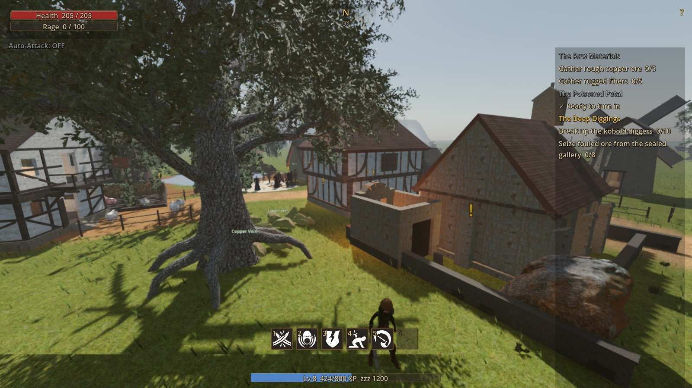
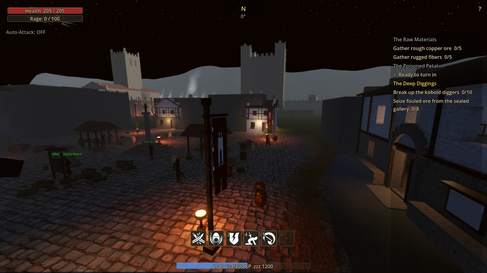
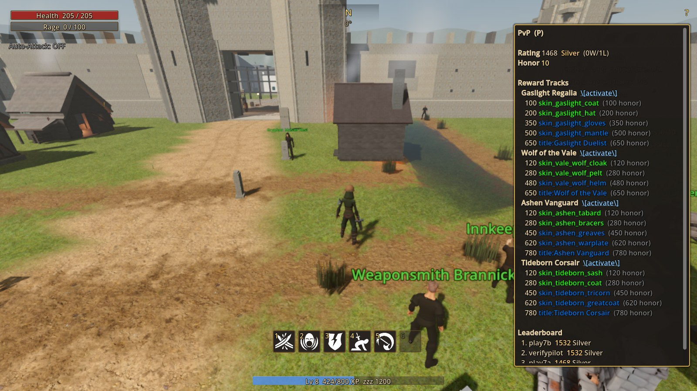
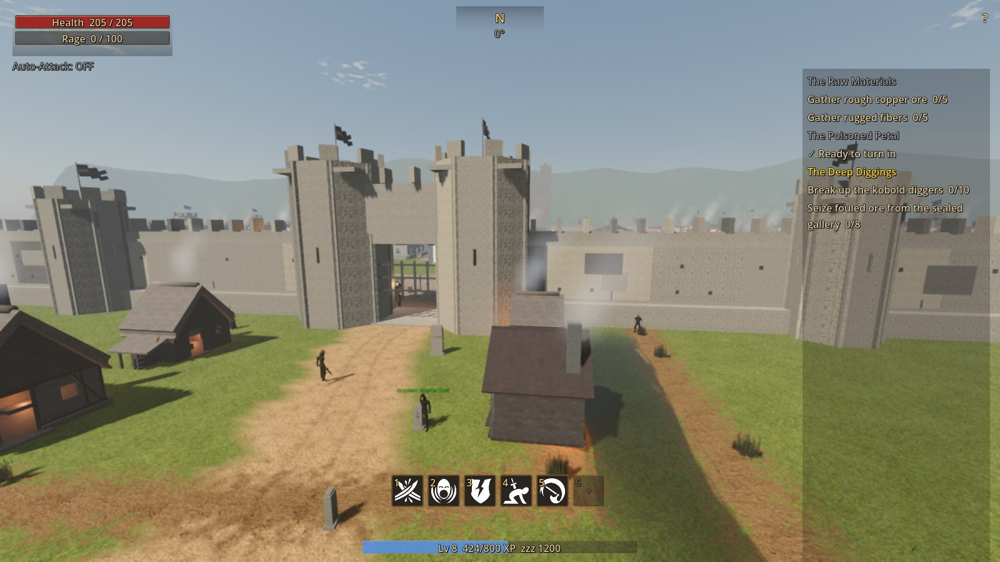

# Avalon

A server-authoritative MMORPG built in Godot 4 — classic UO/WoW-inspired design in an original
world: one seamless map spanning two eras, trinity combat, quest-and-grind leveling, a 5-man
dungeon, consensual PvP with seasonal ladders, and a cosmetics-only economy. Power is never
for sale.



## What's playable

- **Two eras, one world** — a medieval vale and, through the rift, the coal-smog streets of
  Ashmoor (level 20–40), each with its own atmosphere, mobs, and economy
- **Server-authoritative combat** — the client sends intents, never state; movement, damage,
  loot, and XP are all validated server-side against the server's own clock and sessions
- **Trinity classes** with talents, trained ability ranks, and gear that genuinely matters
  (equipment stats feed combat; durability wears on death; repair is a real coin sink)
- **A living economy** — quests, vendors, banking, auctions, trade, and an append-only coin
  ledger keeping inflation honest
- **The Hollowed Crypt** — a 3-boss, 5-man dungeon beneath the churchyard, with loot tiers,
  daily lockouts, and an LFG board
- **Consensual duels** with Elo ratings, seasonal ladders, honor rewards, reward tracks, and
  earned titles rendered under nameplates
- **A place that feels alive** — day/night cycle with a physically-correct sun, weather,
  positional soundscapes, wandering NPCs with schedules, and social play: chat channels,
  friends, guilds, emotes





## Architecture

- `client/` — the Godot game client (3D world, prediction + server reconciliation)
- `server/gateway/` — login, JWT issuance and rotation
- `server/master/` — persistent state authority: characters, inventory, quests, economy, ratings
- `server/world/` — real-time simulation: movement, combat, mob AI, interest-scoped broadcasts
- `infra/` — Postgres schema migrations (state-tracked, applied automatically at boot)
- `scripts/` — dev stack tooling, verification gates, audits, benchmarks

## Download & play

Grab the client for your OS from the **[latest release](../../releases/latest)**:

| OS | Download | How to run |
|---|---|---|
| **Windows** | `avalon-playtest-<date>-windows.zip` | Unzip anywhere, double-click **`Avalon.exe`**. If SmartScreen objects (unsigned indie build), click *More info → Run anyway*. |
| **Linux** | `avalon-playtest-<date>-linux.zip` | Unzip, then `chmod +x Avalon.x86_64 && ./Avalon.x86_64` |
| **macOS** | — | No client build yet. The server runs from source on macOS (below); a Mac client is on the roadmap. |

The bundled `server.cfg` points at the hosted playtest server; **accounts are invite-based**
(playtest access is provisioned personally). To play without an invite, run your own server
below, create an account on it, and edit `server.cfg` next to the client to `host="localhost"`.

## Run your own server

The full stack is three Godot services (master → gateway → world) plus Postgres. Migrations are
tracked and applied automatically by the run scripts; everything listens on localhost by default.

**Windows** — install [Docker Desktop](https://www.docker.com/products/docker-desktop/) and
[Godot 4.7.1](https://godotengine.org/download/archive/) (put the exe next to the script, on
PATH, or set `GODOT_EXE`), then double-click:

```
scripts\windows\run-server.bat        starts Postgres, applies migrations, launches all three servers
scripts\windows\create-account.bat    makes a player account (prints the generated password once)
scripts\windows\stop-server.bat       stops everything (your data is kept)
```

**Linux** — requires Godot 4.7.1, a Postgres container (Docker or Podman), and `psql`:

```bash
cp .env.example .env                    # fill in secrets (any 32-byte hex strings work)
./scripts/dev-up.sh                     # Postgres check, DB migrations, gateway + master + world
./scripts/tester-accounts.sh add <name> # create a player account (prints the password once)
./scripts/play.sh <name>                # launch a client against your local stack
./scripts/dev-down.sh                   # stop everything
```

**macOS** — same flow as Linux: install Godot 4.7.1 (`brew install --cask godot` or the
official download), run Postgres via Docker Desktop (`docker compose -f infra/docker-compose.yml
up -d postgres`), then use the Linux scripts above. The Godot binary is resolved through
`scripts/godot-bin.sh`; set `GODOT_BIN=/Applications/Godot.app/Contents/MacOS/Godot` if it
isn't found automatically.

**Verify a source checkout:**

```bash
./scripts/run-tests.sh        # full test suite across all four projects
```

## License / IP

Original lore, names, and assets throughout. No third-party game IP is used or reproduced.
